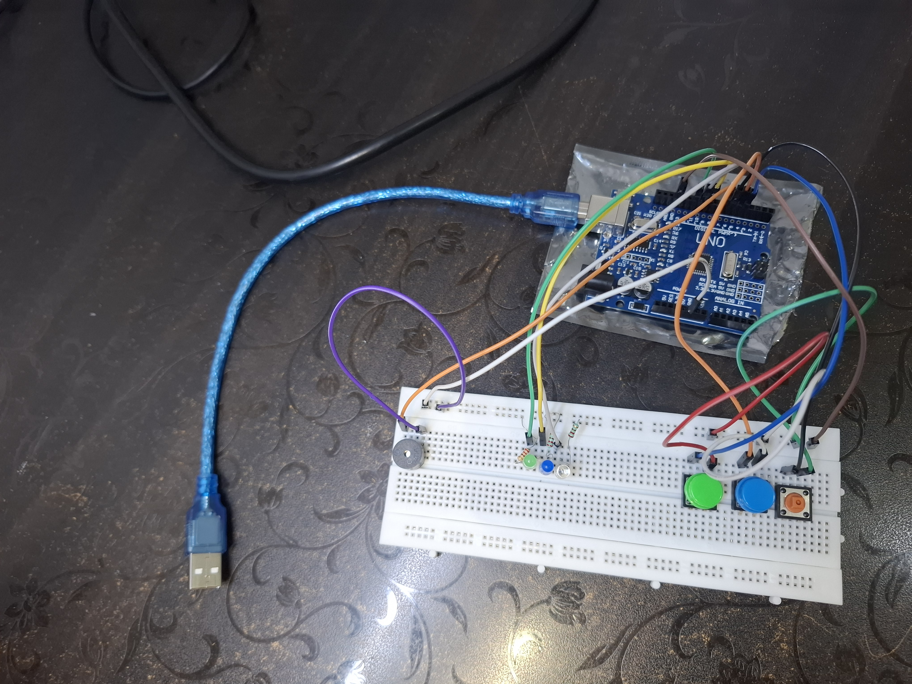

# Simon-style Retro Memory Game 

# Project Status

✅ **Full relase** 

## Current version

**Version: v1.0.0 (Full release)**

_Latest update: Full release_

Current features:
- Fully playable game loop
- Random sequence generation
- Player input validation
- Progressive difficulty
- Win/Loss sequences 
- Unique audio feedback on player input
- Startup melody 
- Custom multi level with open circuit design PCB
- Battery powered usability 

## Overview

This project is a Simon-style memory game built using an Arduino Uno. The player must memorize and repeat an increasingly long sequence of colored LEDs using the corresponding push buttons.

The project focuses on embedded systems programming, finite state machines, input validation, timing control and modular code design. It is being developed incrementally, with each version introducing new gameplay mechanics and hardware features. Development is being tracked using Git for versioning to document project progression.

📹 **[Gameplay Demo (Breadboard)](evidence/demo_v1.mp4)**

## Importan Note
To make sure this project is accessible to as many people as possible. I have used an open circuit design without a proper enclosure and rather used the PCB itself as an enclosure to preserve the retro feel of the product and ensure anyone with any kind of components can create and use it. As the a case would require strict measurements and only certain parts to be used. I don't intend to turn this into a consumer grade product, if anyone feels like they would like to please fell free as long as you credit me in the design.  

## Gameplay Overview:
At startup, a random sequence of LEDs is displayed. The player must replicate the sequence using the corresponding colored buttons. Each successful round increases the difficulty by extending the sequence length and increasing the playback speed. If the player enters an incorrect sequence at any point, the game ends and they must restart the game.

## Bill of Materials (BOM)

| Qty | Component | Value / Part | Description |
|---:|------------|--------------|-------------|
| 1 | Arduino Nano | Arduino Nano v3.x | Main microcontroller |
| 1 | 9 V Battery | — | Power source |
| 1 | Piezo Buzzer | — | Polarized buzzer for audio feedback |
| 1 | Red LED | — | Visual feedback |
| 1 | Green LED | — | Visual feedback |
| 1 | Blue LED | — | Visual feedback |
| 3 | Resistors | 220 Ω | Current-limiting resistors for LEDs |
| 1 | 10 kΩ Potentiometer | B10K | Linear potentiometer |
| 1 | Red Push Button | SW_Push | User input |
| 1 | Green Push Button | SW_Push | User input |
| 1 | Blue Push Button | SW_Push | User input |
| 1 | Power Switch | SPST | Main power switch |
| 1 | 1×8 Pin Header | Male | Board-to-board connector |
| 1 | 1×8 Socket Header | Female | Board-to-board connector |
| 1 | 1×1 Pin Header | Male | Single-pin connector |
| 1 | 1×1 Socket Header | Female | Single-pin connector |

## Planned Features:
-  EEPROM based high score 

# Progress Roadmap:

## Section 1: Planning

* [x] Define project concept
* [x] Select components
* [x] Create GitHub repository
* [x] Create initial project structure
* [x] Draft wiring schematic

## Section 2: Core Hardware

* [x] Connect LEDs and verify operation
* [x] Connect buttons and verify input
* [x] Connect buzzer and verify sound output
* [x] Build and test complete circuit

## Section 3: Core Game Logic

* [x] Generate random sequences
* [x] Display sequence to player
* [x] Read player input
* [x] Validate player input
* [x] Implement win/lose conditions
* [x] Add score tracking
* [x] Add correct game progression

## Section 4: Difficulty System

* [x] Increase sequence length each level
* [x] Add potentiometer to control LED blink speed
* [x] Balance game difficulty

## Section 5: Audio Feedback

* [x] Add unique tones for each button
* [x] Add correct input feedback
* [x] Add loss melody
* [x] Add startup melody
* [x] Add win melody

## Section 6: Enclosure Design 

* [x] Create initial enclosure concept
* [x] Design button layout
* [x] Design LED placement
* [x] Create custom PCB
* [x] Create enclosure v1
* [x] Refine enclosure based on testing
* [x] Finalize enclosure design

## Section 7: Testing & Optimization

* [x] Test all game functions
* [x] Fix identified bugs
* [x] Improve code organization
* [x] Perform final hardware verification

## Section 8: Documentation

* [x] Create final schematic
* [x] Add circuit images
* [x] Add project photos
* [x] Document challenges faced
* [x] Document lessons learned
* [x] Complete README

## Challenges Faced

- Designing a reliable input validation system while preventing accidental multiple button presses.
- Debugging state transition issues that caused the game logic to become inconsistent.
- Resolving timing conflicts between LED animations and player input.
- Preventing invalid variable values caused by unintended state changes.
- Structuring the code into reusable functions to improve maintainability.
- Finding accurate part footprints.
- Aligning parts to create multi level PCB

> Additional challenges will be documented as development continues.

## Skills Learned

- Finite State Machine (FSM) design
- Edge detection for button input
- Software debouncing techniques
- Modular programming using custom functions
- Enum-based state management
- Switch-case driven program flow
- Random sequence generation
- Timing management using millis()
- Debugging embedded software
- Hardware/software integration
- Multi level PCB design 

> Additional skills will be documented as development continues.

## Section 9: Future Improvements
* [ ] Add  EEPROM to save important user data such as high scores
* [ ] Add LCD for live feedback
* [ ] Create custom win/loss screens for the LCD
* [ ] Add an LED matrix to increase difficulty as sequences can come from a bigger space and in a harder to remember pattern
* [ ] Add a charging feature to improve portability
* [ ] Multiple gameplay modes
* [ ] Use ESP32 instead of Arduino to link the game to an online leaderboard

## Images

### Hardware Prototype v1

### Hardware Prototype v2

## Version History

### v1.0.0
- Multi level PCB
- Open circuit design

### v0.6.0
- Custom PCB 
- Battery power 

### v0.5.0
- Added unique audio feedback for each button
- Added startup melody
- Added win melody
- Added loss melody
- Integrated audio feedback into gameplay

### v0.4.0
- Playable beta release
- Added input validation
- Added win/lose sequences
- Improved game progression

### v0.3.0
- Added score tracking
- Added progressive difficulty using random sequences that increase in length after each successful round 
- Added a potentiometer to control LED speed

### v0.2.0
- Initial hardware prototype and schematic

### v0.1.0
- Initial planning
